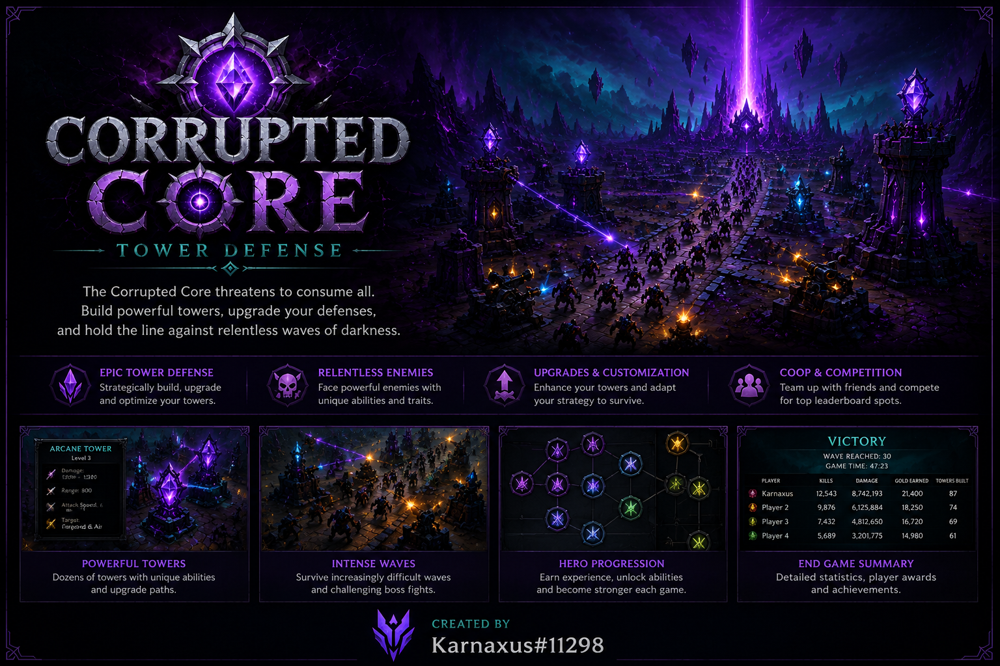

# Corrupted Core TD



**Created by Karnaxus#11298**

## Overview

Corrupted Core TD is a cooperative Warcraft III: Reforged Tower Defense map where invaders emerge from the center of the map and attempt to reach one of four corner end zones.

Players must work together to build, upgrade, and coordinate their defenses to stop increasingly powerful waves of corrupted invaders. Air waves, boss waves, difficulty scaling, and strategic tower placement all play a critical role in survival.

## Features

- Cooperative multiplayer gameplay
- Multiple difficulty levels
- Air waves and Boss waves
- Config-driven wave system
- Dynamic invader pathing
- Tower upgrades and sell/refund system
- Per-wave statistics and leaderboards
- Command system
- Lua-based architecture
- Custom multiboard and UI systems
- Player build zone permissions (allow/deny other players to build or not build in your build zone)
- Interesting boss mechanics

## Commands

- `/commands` - Display available commands
- `/air` - Show air waves
- `/boss` - Show boss waves
- `/enable tips` - Enable gameplay tips
- `/disable tips` - Disable gameplay tips
- `/enable debug` - Enable debug output
- `/disable debug` - Disable debug output
- `/enable wavesummary` - Enable wave end summary results
- `/disable wavesummary` - Disable wave end summary results
- `/allowbuild <player|all>` - Allow building in your zone
- `/denybuild <player|all>` - Remove build permission for your zone

## Project Structure

```text
src/
├── core/
├── config/
├── systems/
├── ui/
└── managers/
```

## Source Code

This repository contains the Lua source code used to develop Corrupted Core TD.

The playable Warcraft III map may be distributed separately and may be protected from editing. The purpose of this repository is to provide transparency, educational value, and version history for the project's development.

## Reporting Bugs

Found a bug or issue while playing Corrupted Core TD?

Please submit an issue on GitHub and include as much information as possible.

See [BUG_REPORTING.md](BUG_REPORTING.md) for details.

## Credits

Created and maintained by:

**Karnaxus#11298**
